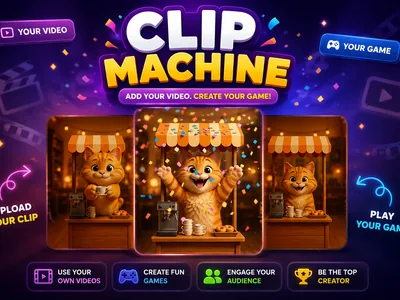
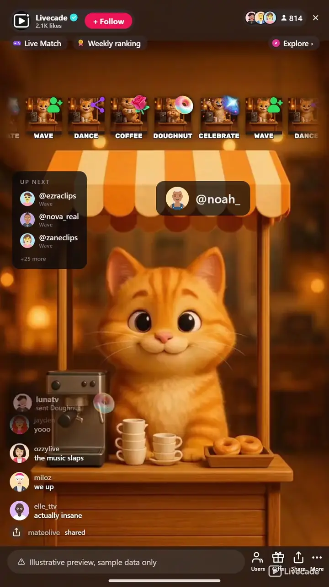

# Clip Machine - Interactive TikTok Live Game

> Bind any video to any trigger, and let your chat decide which one plays next.

Your own videos, played on cue. A background clip loops while you stream, and when someone sends a gift, comments, follows, shares or likes, the screen cuts to whichever video you bound to that trigger, plays it once, and goes back to the loop.

**[Play Clip Machine on Livecade](https://livecade.io/games/clip-machine/?utm_source=github&utm_medium=readme&utm_campaign=clip-machine)** - runs as a single browser source in OBS, Streamlabs, or TikTok LIVE Studio. Nothing for viewers to install.

## How viewers play

Viewers take part with the actions TikTok already gives them: **gifts**, **comments**, **likes**, **follows**, **shares**. Every action below is rebindable, so you decide which interaction drives which effect.

| Action | What it does |
| --- | --- |
| **Play Clip** | Cuts to the video bound to this row, plays it once, and returns to the background loop. Add up to thirty of these, each with its own video, icon, name and trigger. Any of the six trigger types can fire one |

## How it works

### A row is a video and a trigger

Name it, pick the video, pick the icon your viewers see, and choose what fires it. Up to thirty rows, each one independent, and you can change any part of a row without touching the others.

### The background is a rotation, not one loop

Idle videos play shuffled and never run the same one twice in a row, so what is on screen most of your stream does not read as a single clip repeating. Add up to eight of your own.

### One clip at a time, gifts first

Triggers that arrive while something is playing wait their turn, with gifts ahead of the free ones so a paying viewer is never stuck behind a run of follows. Only the video on screen is audible, so a reaction never talks over the background.

### Your viewers can see what they can trigger

The icon you picked for each row rides in a scrolling belt on screen, so chat is looking at a menu of every clip they can set off rather than guessing. Drag it wherever you want it.

## About the game

Clip Machine turns your videos into the game. Instead of a scoreboard or an arena, the screen is a video: a background rotation you chose plays while nothing is happening, and every time a viewer does something you have bound, it cuts to the clip you picked for that exact trigger, plays it through once, and returns to the loop. What your chat is really doing is picking which of your videos plays next.

### Any trigger, any video, thirty of them

Every row is one binding: a name, a video, an icon, and the thing that fires it. That can be a specific gift, any gift over an amount you set, a comment keyword, a follow, a share or a like, and you can add up to thirty rows. Nothing is hardcoded to gifts, which means the free actions your quiet viewers can afford get clips too, not just the paid ones.

### It ships with a working game in it

You do not have to upload anything to go live with it. Clip Machine comes with a starter pack already bound across five different trigger types, plus a four-clip background rotation that shuffles so the same one never runs twice in a row. Replace any of it a piece at a time, or clear the lot and put your own videos in.

### Built for a real chat, not a demo

One viewer spamming the same gift thirty times gets one clip with a count on it rather than thirty in a row, while thirty different viewers each get their own. Whoever set a clip off is credited under it with their profile picture, and an on-screen list shows who is waiting, so a viewer who paid can see their clip coming. A clip that fails to load never jams the rest.

### Gifts never wait behind free triggers

Clips play one at a time, so a rush has to queue. A gift goes to the front of that queue rather than sitting behind a run of follows and likes, and if the queue is full it takes a free trigger's place instead of being thrown away. Nobody who spent coins on your stream gets skipped because the queue happened to be busy.

## What it looks like on stream

[Watch Clip Machine gameplay](https://cdn.livecade.io/games/clip-machine.mp4)

## What you can configure

- **Idle Videos** - The background rotation, up to eight of your own videos. Shuffled so the same one never plays twice running. Leave it empty to keep the built-in pack
- **Video fit** - Cover fills the frame and crops the edges, contain shows the whole video and letterboxes it. Applies to the background and the reactions alike
- **Show what is up next** - Lists the viewers waiting for their clip to play, with how many rows to show
- **Volume** - How loud the videos play, background and reactions alike. Sits under the Game SFX channel in the audio mixer
- **Show who triggered it** - Credits the viewer under the clip with their profile picture, and a count when they sent several at once

## FAQ

<strong>What actually happens when a viewer triggers a clip?</strong>

The screen cuts from your background rotation to the video you bound to that trigger, plays it through once with its own sound, and cuts straight back to the loop. There is no scoring and no round: the game is your videos, and chat is choosing which one plays.

<strong>Does it only work with gifts?</strong>

No. A row can be fired by a specific gift, by any gift over an amount you set, by a comment keyword, by a follow, by a share or by a like. The pack it ships with is deliberately bound across five different trigger types so the free ones are in play from the start.

<strong>How many clips can I have?</strong>

Thirty trigger rows, plus up to eight background videos. On the free plan three of the trigger clips can be your own uploads and the rest use the ones it ships with. Paid plans lift that, and the background rotation is never counted against it on any plan.

<strong>What videos can I upload?</strong>

MP4 or WebM. A reaction clip can run up to 15 seconds and 12 MB, and a background video up to 60 seconds and 25 MB. You can upload a file, pick one already in your library, or paste a URL to pull one in.

<strong>How do I make my own clips?</strong>

However you like: any AI video tool, or a camera on a tripod. The one rule that matters is starting every clip from the same reference image, so your character and background do not change between them. There is a guide in the docs with the exact prompt setup and settings used for the pack the game ships with, including what it cost.

<strong>Do I need to upload anything to use it?</strong>

No. It ships with a starter pack already bound and ready, so you can add it to your stream and have a working game immediately. Swap the clips out whenever you want, one at a time or all at once.

<strong>What if a viewer spams the same gift?</strong>

One viewer sending the same gift several times in a row gets one clip with a count next to their name, not the same video ten times over. Different viewers sending the same gift each get their own play, so nobody who paid is skipped.

<strong>What happens if lots of triggers arrive at once?</strong>

They queue and play out one after another rather than fighting over the screen. The queue is bounded so a huge rush cannot back the game up for minutes behind clips nobody remembers sending.

<strong>Can I move the icons off the middle of the video?</strong>

Yes. The trigger belt and the viewer credit are both drag-repositionable in the overlay preview, and where you put them is saved.

<strong>Is there background music?</strong>

No, and deliberately. Your clips carry their own audio and are the soundtrack, so a music bed underneath would fight every one of them.

<strong>How do I add Clip Machine to my TikTok Live?</strong>

Add one browser source URL to OBS or your streaming software and go live. There is no plugin to install and nothing for your viewers to download.

## Setup

1. [Create a Livecade account](https://app.livecade.io/register?utm_source=github&utm_medium=cta&utm_campaign=clip-machine)
2. Copy your overlay browser source URL
3. Paste it into OBS, Streamlabs, or TikTok LIVE Studio
4. Pick Clip Machine, set your triggers, and go live

Runs in the browser, so it works on Windows and macOS with nothing to download. [See all TikTok Live games](https://livecade.io/tiktok-live-games/?utm_source=github&utm_medium=readme&utm_campaign=clip-machine).

---

_This repository documents Clip Machine, a hosted interactive game by [Livecade](https://livecade.io/?utm_source=github&utm_medium=footer&utm_campaign=clip-machine). The game runs on Livecade's platform, so there is no source to install here._
